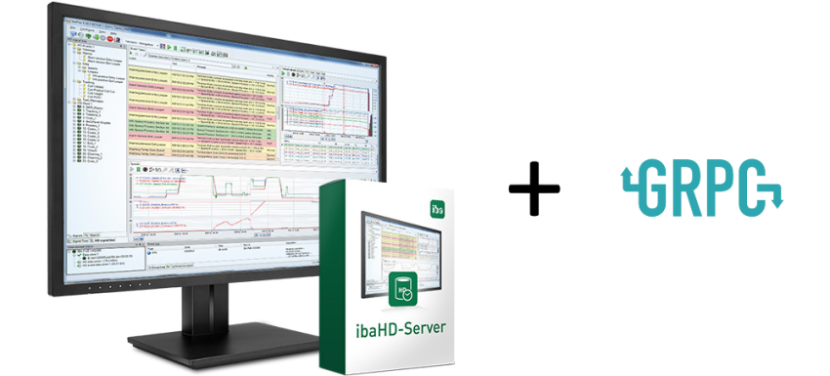
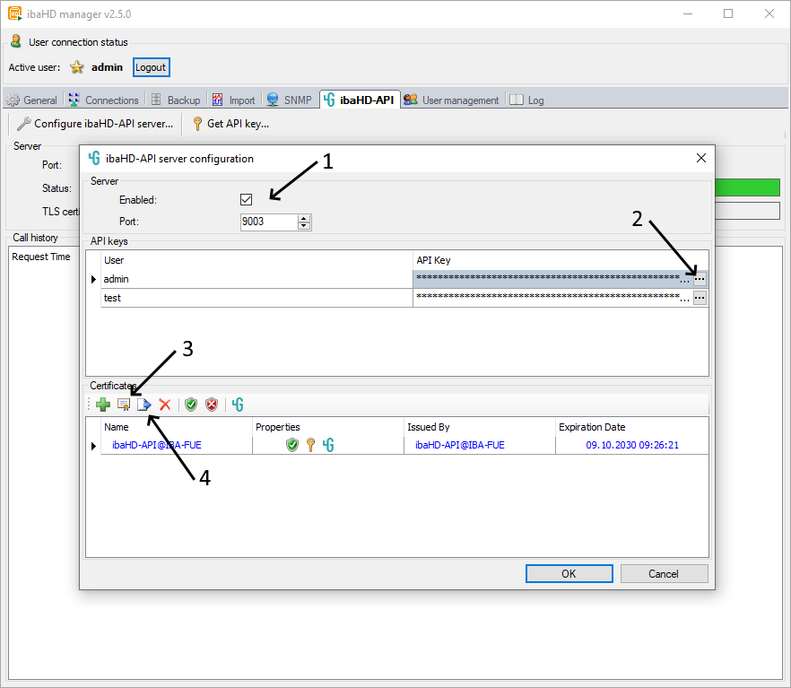

# ibaHD-API

This [gRPC](https://grpc.io)-based API allows retrieving historical time and event data from [ibaHD-Server](https://www.iba-ag.com/en/ibahd-server). gRPC uses Protobuf both as seralization format and interface definition language. Clients for a wide range of languages can be generated from the interface definition.

## Requirements

- [ibaHD-Server](https://www.iba-ag.com/en/ibahd-server) version >= 2.5.0
- ibaHD-API license on Marx dongle

## Disclaimer

This code is provided “as is” and serves as an example for the usage of ibaHD-API. The integration of ibaHD-API in external systems and general support for programming languages is not provided by iba AG. All terms of ibaHD-Server's license agreement apply.

## Quick Start

**Enable and configure ibaHD-API in ibaHD-Server**

1. Enable ibaHD-API
2. Generate an API key (Only available when user management is enabled)
3. Generate a TLS server certificate
4. Export the certificate as PEM format (*.crt, *.key) for usage in the API client

**Follow the guidelines of the sample clients:**

[C# Sample Client](csharp/README.md)

[C++ Sample Client](cpp/README.md)

[Python Sample Client](python/README.md)

## Where is the documentation for API calls?

The full API documentation can always be found in `C:\Program Files\iba\ibaHD-Server\ibaHD-API\ibaHD-API.proto` when ibaHD-Server is installed. It is readable with any text editor.

Depending on the programming language, the casing and naming of the fields and messages might slightly differ from the .proto definition as the Protobuf compiler applies language specific code style conventions when generating the client code.

## What about other languages and platforms?

gRPC supports a wide range of languages and platforms, see  [https://grpc.io/docs/languages/](https://grpc.io/docs/languages/).

For each language a quick start and a basic tutorial is available on the gRPC website. Additionally example code matching the tutorials can be found on GitHub(e.g. [Examples for Go](https://github.com/grpc/grpc-go))

The steps are similar for all languages:

1. Take the `C:\Program Files\iba\ibaHD-Server\ibaHD-API\ibaHD-API.proto` as input for the code generation
2. Generate the ibaHD-API client code, usually either by using the `protoc` Protobuf Compiler or other tooling that is referenced in the guide (e.g. [Generate the client and server code for Go](https://grpc.io/docs/languages/go/basics/#generating-client-and-server-code))

3. Add generated code to your project
4. Reference the gRPC base libaries to your project (e.g. [Additional imports for Go](https://github.com/grpc/grpc-go/blob/4e8458e5c63864a0216745133b894869c37d9883/examples/route_guide/client/client.go#L32))

5. For the client code to work the following data must be set in the gRPC/ibaHD-API client:
   - IP/Hostname of the machine + Port of the ibaHD-API server (default port is 9003, configurable in ibaHD manager)
   - API Key (If user management is enabled)
   - TLS certificate (usually in PEM format)

**Additional documentation**

[Configure TLS for gRPC clients](https://grpc.io/docs/guides/auth/#examples)
